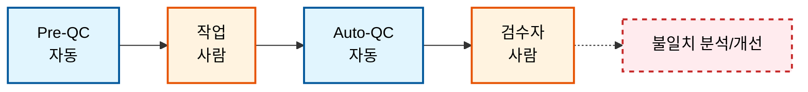
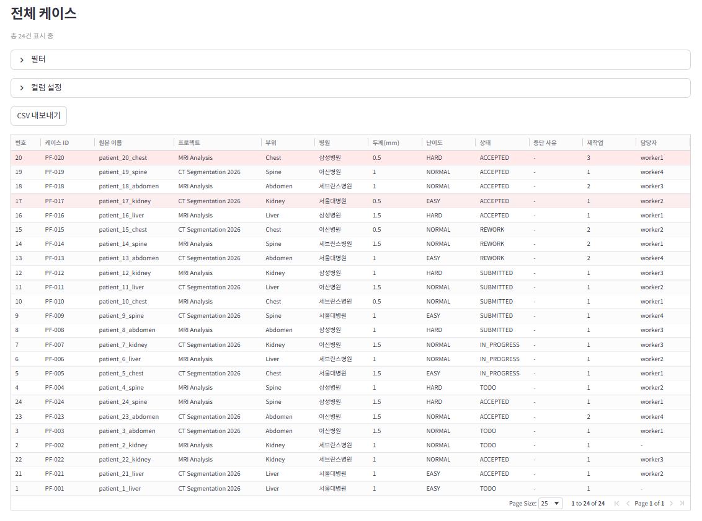
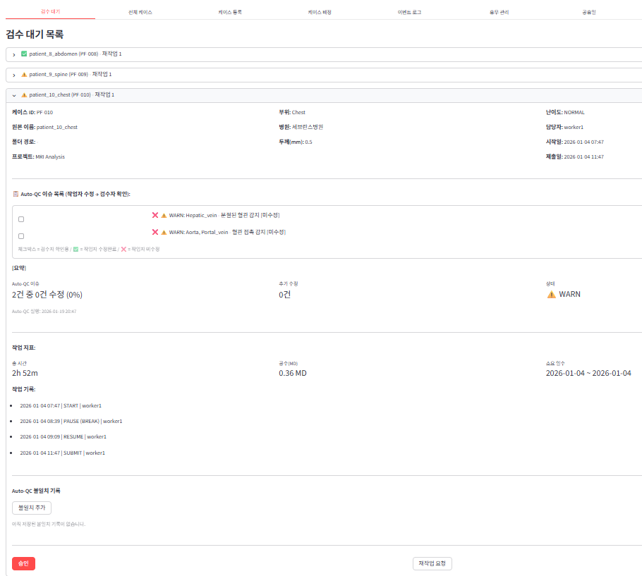
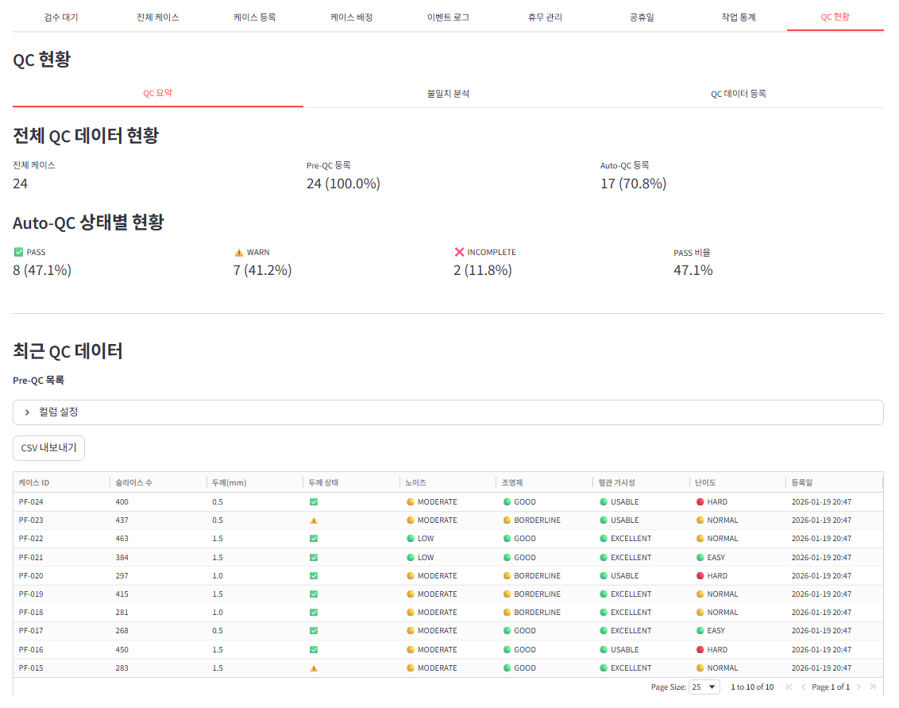
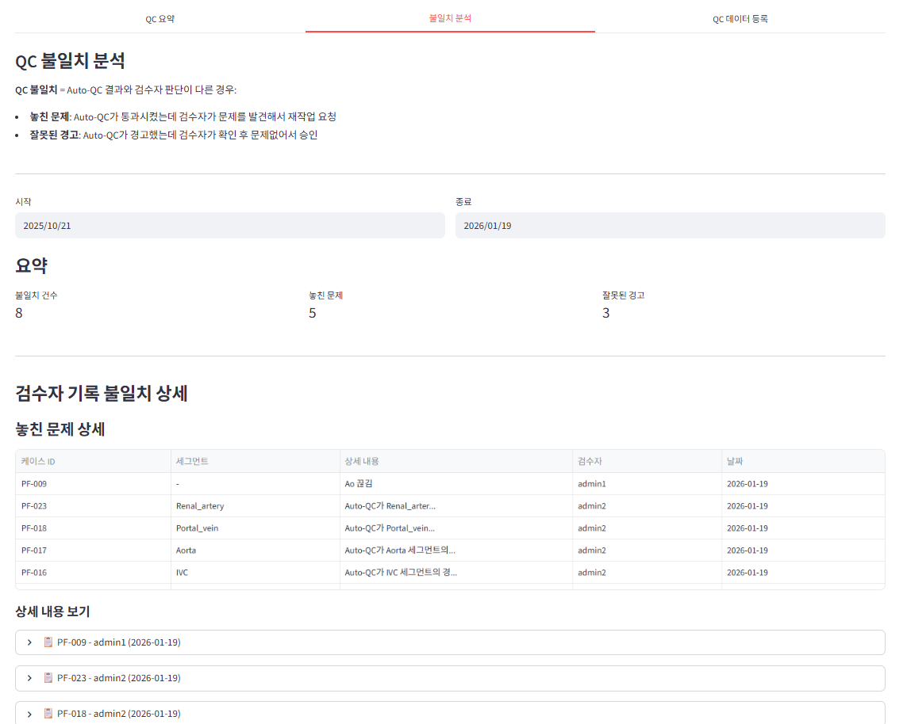

# QC Management System

> **Human-in-the-loop QC 운영 시스템 (Data Operations)**
> AI 자동 검수와 사람 검증의 협업 구조를 설계하고, 불일치 패턴을 데이터로 축적하여 검수 기준을 개선하는 시스템

- **Role**: 기획, 시스템 설계, 구현 (1인 개발)
- **Duration**: 2026.01 ~ (진행 중)
- **Tech Stack**: FastAPI, Streamlit, SQLAlchemy, Pytest

---

## 1. 프로젝트 배경 및 목적

- **문제 정의**: AI가 생성하거나 처리한 데이터는 자동 검수(Auto-QC)만으로 완벽한 품질 보장이 어려움.
- **해결 방안**: 사람의 도메인 전문성으로 AI가 놓친 오류를 보완하고, 그 과정에서 발견된 패턴을 다시 자동화에 반영하는 구조(Loop) 설계.
- **확장성**: 본 프로젝트는 의료 영상 세그멘테이션을 예시로 구현했으나, 핵심 워크플로우는 **텍스트 요약, 분류, 파이프라인 데이터 검증 등 다양한 도메인으로 즉시 확장 가능(Domain Agnostic)**.

---

## 2. 시스템 구조 (AI-Human QC 협업 흐름)

| 단계 | 주체 | 설명 |
|------|------|------|
| Pre-QC | 자동 | 작업 전 데이터 품질 분석 (난이도, 노이즈 등) |
| 작업 | 사람 | 실제 작업 수행 |
| Auto-QC | 자동 | 작업 결과 자동 검증 → PASS / WARN / INCOMPLETE |
| 검수 | 사람 | Auto-QC 결과 확인 → 승인 / 재작업 요청 |
| 불일치 분석 | 시스템 | Auto-QC vs 사람 판단 차이 기록 및 분석 |
| 기준 개선 | 운영 | 불일치 패턴 → QC 기준 및 자동화 로직 개선 |

---

## 3. 핵심 개념: 불일치 유형 (Mismatch Type)

AI 자동 검수와 사람 검수의 판단이 다른 경우를 두 가지로 분류하여 관리합니다.

| 유형 | 영문 | 설명 |
|------|------|------|
| 미검출 | False Negative | AI가 정상으로 판정했으나 실제로는 오류인 케이스 (Risk) |
| 과검출 | False Positive | AI가 오류로 경고했으나 실제로는 정상인 케이스 (Efficiency Loss) |

→ 이 불일치 데이터를 축적하면 "AI가 어디서 틀리는지" 패턴이 보입니다.
→ 이 패턴은 QC 기준 개선 및 모델 재학습(Re-training)의 핵심 자산이 됩니다.

---

## 4. 주요 기능

**(A) 케이스 관리**
- 등록 / 배정 / 상태 추적 / 이벤트 로그
- 상태: TODO → ASSIGNED → IN_PROGRESS → SUBMITTED → IN_REVIEW → COMPLETED / REWORK

**(B) QC 워크플로우**
- 작업자: QC 이슈 수정 체크 + 추가 수정 사항 기록 (유형: 미검출/과검출)
- 검수자: 작업자 수정 확인 + 불일치 기록 + 승인/재작업 결정

**(C) QC 불일치 분석 탭**
- 미검출(False Negative) / 과검출(False Positive) 집계
- 세그먼트별(또는 항목별) 불일치 통계
- **운영 지표로서 불일치율(Mismatch Rate)을 추적하여 QC 기준 개선에 활용**

**(D) 작업 통계 대시보드**
- 성과: 완료 / 재작업 / 1차 통과율
- 분포: 카테고리별 작업 분포
- 가동률: 근무일 대비 실제 작업 시간

---

## 5. 기술 스택 및 개발 방식

| 분류 | 기술 |
|------|------|
| Backend | FastAPI, SQLAlchemy, SQLite |
| Frontend | Streamlit |
| Testing | pytest (77 tests passed) |
| Arch | Router / Schema / Service / Repository 레이어 분리 |
| Docs | Swagger (OpenAPI) |

### 🤖 AI-Assisted Development (AI 협업)

본 프로젝트는 **도메인 전문가(Domain Expert)의 기획력**과 **Generative AI의 코딩 능력**을 결합한 사례입니다.

- **Role**: 핵심 비즈니스 로직 설계, 데이터 모델링, QA 및 디버깅 수행
- **AI 활용**: LLM(Claude)을 활용한 프롬프트 엔지니어링으로 복잡한 SQL 쿼리 및 Pydantic 스키마 구현 시간을 단축
- **의의**: 비개발 직군(Operations)도 AI를 활용하면 실무에 필요한 자동화 도구를 직접 구축할 수 있음을 증명

---

## 6. 설계 원칙 및 구현 특징

- **API 계약 기반 개발**: 기능 변경 없이 안전한 리팩토링 가능
- **단일 집계 함수 (SSOT)**: 요약/상세가 동일한 기준으로 계산 (데이터 불일치 방지)
- **테스트 안정성**: 트랜잭션 격리로 77개 테스트 100% 통과 유지
- **저장 후 재조회 패턴**: UI 상태 불일치 방지

---

## 7. 설계 인사이트 (Design Insights)

이 프로젝트를 통해 얻은 Research Operations 관점의 인사이트입니다.

### 1. Disagreement Point가 핵심 자산
- AI와 사람의 판단이 갈라지는 지점(불일치)을 "비용"이 아니라 "자산"으로 봐야 합니다.
- 이 데이터가 모델 성능 향상의 핵심 키(Key)가 됩니다.

### 2. QC는 단순 검수가 아니라 운영 시스템
- 검수 기준 정의 → 자동화 → 예외 케이스 수집 → 기준 개선
- 이 사이클(Loop)이 돌아야 품질이 지속적으로 개선됩니다.

### 3. 운영 지표의 중요성
- 불일치율(Mismatch Rate), 1차 통과율, 재작업률 등을 추적해야
- "느낌"이 아닌 "데이터"로 품질을 관리할 수 있습니다.

---

## 8. 스크린샷

| 운영 개요 | 워크플로우 |
| :---: | :---: |
|  |  |
| **Fig 1. 전체 케이스 운영 현황** | **Fig 2. AI-Human 협업 검수** |

| QC 모니터링 | 불일치 분석 (핵심) |
| :---: | :---: |
|  |  |
| **Fig 3. QC 모니터링 대시보드** | **Fig 4. 불일치 분석 (Mismatch Analysis)** |
